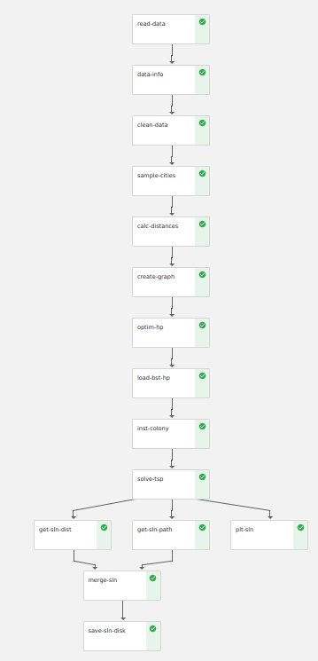

# Pipelines - Primera implementación con Kale y Kubeflow

El propósito de este reporte es mostrar el primer _pipeline_ implementado con `kale` y `kuberflow` en la nube de computo de AWS.

## Preliminares

**Configuraciones del notebook de Kale**

El _notebook_ utilizado tiene las siguientes configuraciones en `Kale`:

**_Pipeline_**

Este _pipeline_ tiene como objetivo utilizar 30 ciudades de China sacadas aleatoriamente del conjunto de datos de China de la base de datos _National Traveling Salesman Problems_ de la Universiudad de Waterloo, disponible [aquí](https://www.math.uwaterloo.ca/tsp/world/countries.html).

Se busca realizar la búsqueda de los mejores hiperparámetros asociados al algoritmo ACO-TSP implementado, encontrar la mejor solución, visualizarla y guardarla en disco en formato JSON. 

- Imports y definición de paŕametros del _pipeline_

- Pasos

Al compilar el grafo direccionado del _pipeline_ obtenemos lo siguiente:

**Crear experimento y ejecutar _pipeline_**

En `kuberflow` creamos un experimento con el _pipeline_ generado anteriormente y lo ejecutamos. El proceso terminó con éxito:

## Referencias

- Repósitorio de Análisis Nuḿerico y Cómputo Científico (Wiki de Minikube y AWS):  https://github.com/ITAM-DS/analisis-numerico-computo-cientifico/wiki/6.Minikube-y-AWS

- Kubeflow Automated pipeLines Engine (KALE): https://github.com/kubeflow-kale/kale

- Lectura de base de datos:  https://github.com/DiegoVicen/som-tsp

  

